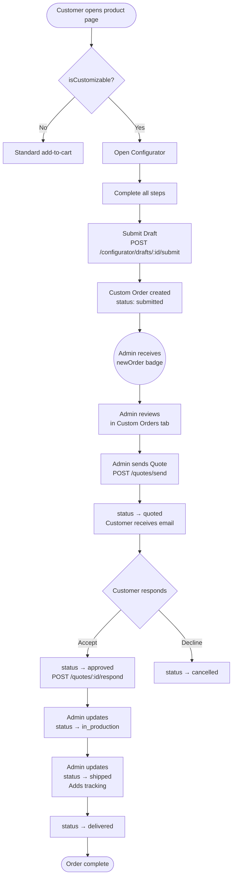
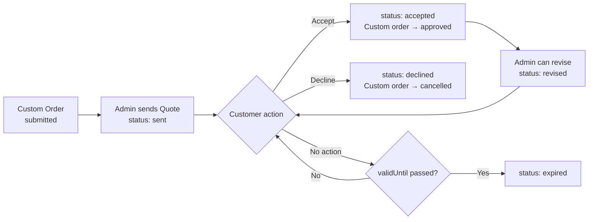
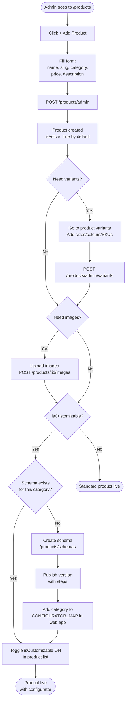
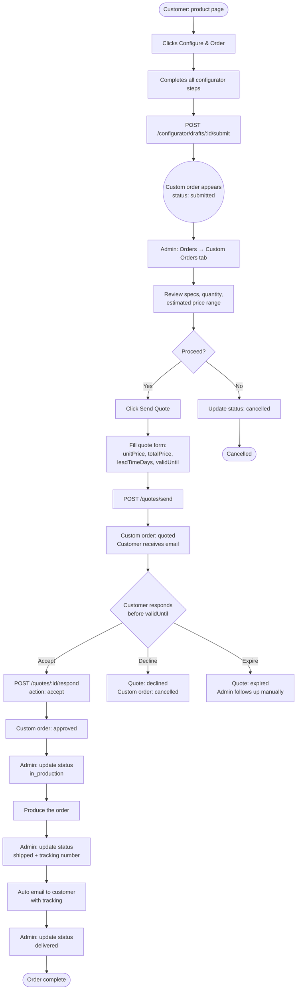
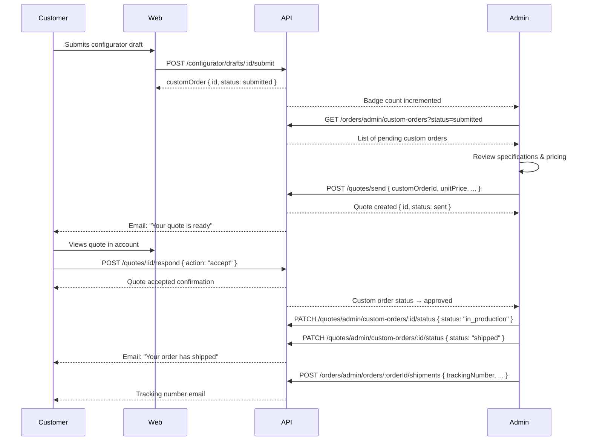
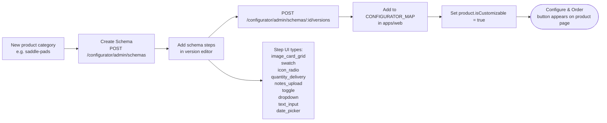

# Blikcart Admin Panel — Technical Guide

> **Version:** 1.0 · **Stack:** Next.js 14 (App Router) · **API base:** `http://localhost:4000/v1`
> **Production:** EC2 `52.49.206.184` — Admin `:3001`, Web `:3000`, API `:4000`

---

## Table of Contents

1. [Architecture Overview](#1-architecture-overview)
2. [Authentication & Access](#2-authentication--access)
3. [Navigation & Layout](#3-navigation--layout)
4. [Dashboard](#4-dashboard)
5. [Products — Full Lifecycle](#5-products--full-lifecycle)
   - 5.1 [Add a Product](#51-add-a-product)
   - 5.2 [Edit a Product](#52-edit-a-product)
   - 5.3 [Variants & Images](#53-variants--images)
   - 5.4 [Category Management](#54-category-management)
   - 5.5 [Configurator Schemas](#55-configurator-schemas)
6. [Orders — All Types](#6-orders--all-types)
   - 6.1 [Standard Orders](#61-standard-orders)
   - 6.2 [Custom Orders](#62-custom-orders)
   - 6.3 [Quotations](#63-quotations)
7. [Customers](#7-customers)
8. [Payments, Invoices & Refunds](#8-payments-invoices--refunds)
9. [Shipping](#9-shipping)
10. [Content / CMS](#10-content--cms)
11. [Analytics](#11-analytics)
12. [Settings](#12-settings)
13. [API Reference](#13-api-reference)
14. [Status Reference](#14-status-reference)
15. [Process Diagrams](#15-process-diagrams)

---

## 1. Architecture Overview

```
┌─────────────────────────────────────────────────────────────────┐
│                        MONOREPO (pnpm)                          │
│                                                                 │
│  ┌──────────────┐  ┌──────────────┐  ┌──────────────────────┐  │
│  │  apps/web    │  │  apps/admin  │  │      apps/api        │  │
│  │  Next.js 14  │  │  Next.js 14  │  │  NestJS + Prisma     │  │
│  │  Port 3000   │  │  Port 3001   │  │  Port 4000           │  │
│  └──────┬───────┘  └──────┬───────┘  └──────────┬───────────┘  │
│         │                 │                      │              │
│         └─────────────────┴──── REST/JSON ───────┘              │
│                                                  │              │
│  ┌────────────────────────┐   ┌──────────────────┴──────────┐   │
│  │    packages/db         │   │       External Services     │   │
│  │    Prisma schema       │   │  Mollie (payments)          │   │
│  │    PostgreSQL          │   │  AWS S3 (images/uploads)    │   │
│  └────────────────────────┘   │  SendGrid/SES (email)       │   │
│                               └────────────────────────────┘   │
└─────────────────────────────────────────────────────────────────┘
```

### Request Flow (Admin Panel)

```
Admin Browser
     │
     ▼
apps/admin (Next.js, 'use client' pages)
     │  axios + Bearer token
     ▼
apps/api /v1/...  (NestJS controllers → services → Prisma)
     │
     ▼
PostgreSQL database
```

### Key Patterns

| Pattern | Detail |
|---------|--------|
| Auth header | `Authorization: Bearer <adminToken>` stored in `localStorage.adminToken` |
| API base | `process.env.NEXT_PUBLIC_API_URL \|\| 'http://localhost:4000/v1'` |
| Inline editing | `editingId` + `editForm` state; no separate edit pages |
| CMS pages | `fetchPageContent(slug, DEFAULT)` — JSON blob from DB with typed `DEFAULT` fallback |

---

## 2. Authentication & Access

### Login

```
POST /v1/auth/login
Body: { email, password }
Response: { accessToken, user: { id, role, fullName } }
```

Token is stored in `localStorage.adminToken`. All admin API calls include:

```js
headers: { Authorization: `Bearer ${localStorage.getItem('adminToken')}` }
```

### Admin Roles

| Role | Permissions |
|------|------------|
| Super Admin | Full access — all modules |
| Ops Admin | Orders, custom orders, quotes, shipping, wholesale |
| Catalog Manager | Products, categories, schemas, CMS |
| Finance Admin | Payments, invoices, refunds, analytics |
| Support Agent | View-only for orders/users, messaging |

### Promote a User to Admin

Settings → Admin Users & Roles → "Promote User" → enter email → select role → Save

---

## 3. Navigation & Layout

The `AdminLayout` component (sidebar) provides 10 navigation items:

| # | Label | Path | Badge |
|---|-------|------|-------|
| 1 | Dashboard | `/dashboard` | — |
| 2 | Orders | `/orders` | — |
| 3 | Products | `/products` | — |
| 4 | Customers | `/customers` | Pending wholesale count |
| 5 | Payments | `/payments` | — |
| 6 | Shipping | `/shipping` | — |
| 7 | Content | `/content` | — |
| 8 | Analytics | `/analytics` | — |
| 9 | Settings | `/settings` | — |
| 10 | Custom Orders (queue) | `/orders` → Custom Orders tab | Submitted count |

> **Badge logic:** Badges are fetched from `GET /auth/admin/stats`. The sidebar shows a count pill for `customOrders` (submitted, awaiting quote) and `wholesale` (pending approvals).

---

## 4. Dashboard

**Path:** `/dashboard`
**API:** `GET /auth/admin/stats`

### KPI Cards (6)

| Card | Description |
|------|-------------|
| Total Revenue | Sum of all paid orders |
| Orders Today | Count of orders placed today |
| Pending Custom Orders | Orders in `submitted` status |
| Active Products | Products with `isActive: true` |
| Pending Wholesale | Users awaiting approval |
| Open Quotes | Quotes in `sent` or `revised` status |

### Action Queues (4)

1. **Custom Orders awaiting quote** — click to go to Orders → Custom Orders tab
2. **Wholesale applications pending** — click to go to Customers
3. **Low-stock variants** — products with quantity ≤ threshold
4. **Quotes expiring soon** — quotes where `validUntil` < 48 h from now

### Charts (2)

- Revenue last 30 days (line chart)
- Orders by type last 30 days (bar chart — standard / custom / mixed)

### Wholesale Quick Approve

Pending wholesale users are listed on the dashboard with one-click **Approve** / **Reject** buttons.

---

## 5. Products — Full Lifecycle

### 5.1 Add a Product

**Path:** `/products`
**Form:** Modal triggered by "+ Add Product" button

```
Step 1 — Fill the Add Product form:
  • Name (required)
  • Slug (auto-generated from name, editable)
  • Category (select from categories list)
  • Base Price (€)
  • Description
  • isActive toggle (default: on)
  • isCustomizable toggle (default: off)

Step 2 — Submit:
  POST /v1/products/admin
  Body: { name, slug, categoryId, basePrice, description, isActive, isCustomizable }

Step 3 — Result:
  Product appears in the list.
  Status column shows Active/Inactive badge.
```

> **Important:** `isCustomizable: true` enables the "Configure & Order" button on the product page in the web storefront. This only works if a published schema exists for the product's category slug (see §5.5).

### 5.2 Edit a Product

Products are edited **inline** in the product list table without navigating away.

#### Editable Fields

| Field | Input Type | Notes |
|-------|-----------|-------|
| Name | text input | — |
| Slug | text input | Must be URL-safe |
| Base Price | number input | — |
| Category | select dropdown | All categories available |
| isCustomizable | checkbox | Enables configurator |
| Description | textarea | Second row below main edit row |

#### Steps

```
1. Click the pencil (✏) icon on the product row
2. Row expands into edit mode — fields become inputs
3. A second row appears with the description textarea
4. Make changes
5. Click ✓ Save → PATCH /v1/products/:id
6. Click ✗ Cancel → discard changes
```

#### Toggle Active/Inactive (one click)

Click the coloured status badge in the Status column:
```
PATCH /v1/products/admin/:id/toggle
```

#### Toggle Customizable (one click)

Click the toggle in the **Custom** column (blue = enabled, grey = disabled):
```
PATCH /v1/products/:id  { isCustomizable: !current }
```

### 5.3 Variants & Images

**Path:** `/products/[id]/variants`

#### Variants

Each product can have multiple variants (e.g. colour, size combinations).

```
Add Variant:
  POST /v1/products/admin/variants
  Body: { productId, name, sku, price, stockQuantity, attributes }

Edit Variant (inline):
  PATCH /v1/products/admin/variants/:id

Delete Variant:
  DELETE /v1/products/admin/variants/:id
```

#### Product Images

```
Upload Image:
  POST /v1/products/:id/images
  Form-data: { file, isPrimary, layerType }

Update Image Metadata:
  PATCH /v1/products/:id/images/:imageId

Delete Image:
  DELETE /v1/products/:id/images/:imageId

Set Variant Image:
  POST /v1/products/:id/variants/:variantId/image
  — or —
  POST /v1/products/:id/variants/:variantId/image-url  (URL-based)
```

> **layerType** is used by the configurator's composite image renderer to stack layers (e.g. `base`, `overlay`, `hardware`).

### 5.4 Category Management

**Path:** `/products` → Categories tab

#### Category Fields

| Field | Notes |
|-------|-------|
| Name | Display name |
| Slug | URL slug (unique) |
| Parent | Parent category (for nested hierarchy) |
| isActive | Show/hide from storefront |

#### Operations

```
Create:
  POST /v1/products/admin/categories
  Body: { name, slug, parentId? }

Edit (inline):
  PATCH /v1/products/admin/categories/:id
  — includes parentId dropdown to reassign parent

Delete: not exposed in UI (use with care)
```

### 5.5 Configurator Schemas

**Path:** `/products/schemas`
**Detail:** `/products/schemas/[id]`

The configurator allows customers to build custom products step-by-step. Each **product category** has one schema; schemas have versioned **step lists**.

#### Configurator Map (web storefront)

The web product page maps category slugs to schema slugs via `CONFIGURATOR_MAP`:

```ts
// apps/web/src/app/products/[category]/[slug]/page.tsx
const CONFIGURATOR_MAP: Record<string, string> = {
  'bridles':   'bridles',
  'halters':   'halters',
  'girths':    'girths',
  'horse-reins': 'horse-reins',
  // add new entries when creating schemas for new categories
};
```

The "Configure & Order" button is only shown when `product.isCustomizable === true`.

#### Creating a New Schema

```
Step 1 — Go to Products → Schemas → "+ New Schema"
Step 2 — Fill schema metadata:
  • Category slug (must match CONFIGURATOR_MAP key)
  • Display name
  • Base price (€)
  • MOQ (minimum order quantity)
  • Standard lead time (days)
  • Express lead time (days)
  • Express price multiplier

  POST /v1/configurator/admin/schemas
  Body: { categorySlug, name, basePrice, moq, leadTimeDays, expressLeadTimeDays, expressPriceMultiplier }

Step 3 — Open the schema → "+ Publish Version"
Step 4 — Build the step list in the version editor:
  Each step has:
  • id, title, description
  • ui_type: image_card_grid | swatch | icon_radio | quantity_delivery |
             notes_upload | toggle | dropdown | text_input | date_picker
  • required: boolean
  • condition: { stepId, value } — show only when another step has a specific value
  • options: [{ label, value, priceModifier, imageUrl, layerKey }]

  POST /v1/configurator/admin/schemas/:id/versions
  Body: { steps: [...], notes: "Version notes" }

Step 5 — For new category: add entry to CONFIGURATOR_MAP in web app
Step 6 — On product(s): set isCustomizable = true
```

#### Schema Version History

```
GET /v1/configurator/admin/schemas/:id
Response: { schema, versions: [{ versionNumber, steps, notes, createdAt }] }
```

Only the **latest published version** is served to customers via `GET /v1/configurator/schema/:categorySlug`.

---

## 6. Orders — All Types

**Path:** `/orders`
Three tabs: All Orders · Custom Orders · Quotes

### 6.1 Standard Orders

Standard orders are placed by customers purchasing directly from the storefront (cart → checkout → payment).

#### Order Fields

| Field | Description |
|-------|-------------|
| orderNumber | Human-readable ID |
| status | pending → confirmed → in_production → shipped → delivered |
| orderType | `standard` / `custom` / `mixed` |
| user | Customer name, email, company |
| items | Count of line items |
| total | Order value (€) |
| placedAt | Timestamp |

#### Update Order Status

```
PATCH /v1/orders/admin/orders/:id/status
Body: { status: "confirmed" | "in_production" | "shipped" | "delivered" | "cancelled" }
```

A dropdown on each order row lets the admin change status in-place.

#### Filters

| Filter | Options |
|--------|---------|
| Status | pending, confirmed, in_production, shipped, delivered, cancelled |
| Type | standard, custom, mixed |

---

### 6.2 Custom Orders

Custom orders are created when a customer completes the **Configurator** flow (`Submit Draft`).

#### Full Custom Order Flow



#### Custom Order Fields

| Field | Description |
|-------|-------------|
| id | Internal UUID |
| status | submitted / quoted / approved / in_production / shipped / delivered / cancelled |
| user | Buyer info (name, email, company) |
| product | Product being configured |
| quantity | Units requested |
| estimatedPriceMin/Max | Price range from schema |
| leadTimeDays | Agreed production time |
| internalRef | Team member assigned |
| specifications | Full configurator selections |
| submittedAt | Submission timestamp |

#### Admin Actions on Custom Order

```
Update Status:
  PATCH /v1/quotes/admin/custom-orders/:id/status
  Body: { status: "in_production" | "shipped" | "delivered" | "cancelled" }

Assign to Team:
  PATCH /v1/quotes/admin/custom-orders/:id
  Body: { internalRef: "team-member-name" }

Filter: status, buyer, date range, product, urgentOnly
Sort: submittedAt, estimatedValue, leadTimeDays (asc/desc)

Bulk Actions (multi-select):
  • Bulk status update
  • Bulk assign

Export:
  CSV export (selected rows or all filtered results)
```

#### Urgency Flag

Orders in `submitted` status older than **2 days** are flagged as urgent in the KPI panel and highlighted in the list.

---

### 6.3 Quotations

A quote is created by the admin in response to a custom order. The customer receives it by email and can accept or decline.

#### Quote Lifecycle



#### Send a Quote

```
POST /v1/quotes/send
Body: {
  customOrderId: "...",
  unitPrice: 250.00,
  totalPrice: 500.00,
  leadTimeDays: 14,
  validUntil: "2026-04-01",
  notes: "Optional notes for customer"
}
```

Triggers: email to customer + status change on custom order to `quoted`.

#### Customer Response

```
POST /v1/quotes/:id/respond
Body: { action: "accept" | "decline" }
```

#### Quote Filters

| Filter | Options |
|--------|---------|
| Status | sent, revised, accepted, declined, expired |

#### Quote KPIs

| KPI | Description |
|-----|-------------|
| Accepted Value | Sum of accepted quote totals (€) |
| Awaiting Response | Quotes in `sent` or `revised` status |
| Accepted | Count of accepted quotes |
| Declined | Count of declined quotes |

---

## 7. Customers

**Path:** `/customers`

### Customer Types

| Type | Description |
|------|-------------|
| retail | Standard B2C customers |
| wholesale | B2B accounts — require approval |
| admin | Platform administrators |

### Wholesale Approval Workflow

```mermaid
flowchart TD
    A([Customer registers\naccountType: wholesale]) --> B[isApproved: false\nListed in pending queue]
    B --> C((Admin sees badge\nin sidebar))
    C --> D[Admin reviews profile\nin Customers page]
    D --> E{Decision}
    E -- Approve --> F[PATCH /auth/admin/users/:id/approve\nbody: { tier: 'wholesale' }]
    E -- Reject --> G[PATCH /auth/admin/users/:id/reject]
    E -- Need info --> H[PATCH /auth/admin/users/:id/request-info]
    F --> I([Customer gets wholesale pricing\n+ email notification])
    G --> J([Customer notified\nof rejection])
    H --> K([Customer receives\ninfo request email])
```

### Customer Actions

```
List all customers:
  GET /v1/auth/users?search=&accountType=&isApproved=

Get customer detail:
  GET /v1/auth/users/:id

Approve (wholesale/admin tier):
  PATCH /v1/auth/admin/users/:id/approve
  Body: { tier: "wholesale" | "admin" }

Reject:
  PATCH /v1/auth/admin/users/:id/reject

Request more info:
  PATCH /v1/auth/admin/users/:id/request-info

Save admin notes:
  PATCH /v1/auth/admin/users/:id/notes
  Body: { notes: "..." }
```

---

## 8. Payments, Invoices & Refunds

**Path:** `/payments`
Three tabs: Transactions · Invoices · Refunds

### Transactions Tab

Lists all Mollie payment events.

```
GET /v1/orders/admin/payments?from=2026-01-01&to=2026-03-31
```

| Column | Description |
|--------|-------------|
| Payment ID | Mollie payment reference |
| Order # | Linked order |
| Customer | Name + email |
| Amount | Payment amount (€) |
| Method | ideal, card, etc. |
| Status | paid, pending, failed, refunded |
| Date | Payment timestamp |

### Invoices Tab

Auto-generated PDF invoices — one per paid order.

```
GET /v1/orders/admin/invoices?from=&to=
```

Each invoice has a **Download PDF** button which generates the invoice on-demand.

### Refunds Tab

```
List refunds:
  GET /v1/orders/admin/refunds

Process a refund:
  POST /v1/orders/admin/payments/:id/refund
  Body: { amount: 50.00, reason: "Damaged in transit" }
```

Refund is processed via Mollie and updates order status automatically.

---

## 9. Shipping

**Path:** `/shipping`

### Shipments

```
List shipments:
  GET /v1/orders/admin/shipments?search=

Create shipment (for an order):
  POST /v1/orders/admin/orders/:orderId/shipments
  Body: { carrier, trackingNumber, estimatedDelivery }

Update shipment:
  PATCH /v1/orders/admin/shipments/:id
  Body: { trackingNumber, status, estimatedDelivery }
```

### Shipping Zones (configured in Settings)

Default zones: Netherlands, Belgium, Germany, Rest of EU, UK, Rest of World

Each zone defines:
- Free shipping threshold (€)
- Standard rate (€)
- Express rate (€)

---

## 10. Content / CMS

**Path:** `/content`
Three tabs: Banners · FAQs · Static Pages

### Banners

```
List: GET /v1/content/admin/banners
Create: POST /v1/content/admin/banners
  Body: { title, subtitle, ctaText, ctaUrl, imageUrl, position, isActive }
Update: PATCH /v1/content/admin/banners/:id
Delete: DELETE /v1/content/admin/banners/:id
```

Positions: `hero`, `mid-page`, `footer-strip`

### FAQs

```
List: GET /v1/content/admin/faqs
Create: POST /v1/content/admin/faqs
  Body: { question, answer, category, order }
Update: PATCH /v1/content/admin/faqs/:id
Delete: DELETE /v1/content/admin/faqs/:id
```

### Static Pages

Pages are stored as a JSON blob in the database. The admin panel has structured editors for each known page slug.

```
Get page:   GET /v1/content/admin/pages  →  find by slug
Update page: PATCH /v1/content/admin/pages/:id
  Body: { content: { ...structuredJSON } }
```

#### Supported Static Pages

| Slug | Page | Editable Sections |
|------|------|-------------------|
| `home` | Homepage | Hero, Features, testimonials |
| `about` | About Us | Hero, mission, team |
| `sizing-guide` | Sizing Guide | Hero, bridle/rug/boot tables + section headings, How to Measure cards, CTA |
| `care-guide` | Care Guide | Sections, tips |
| `faq` | FAQ | Handled via FAQs tab |

#### Sizing Guide CMS Fields

```
hero.eyebrow, hero.title, hero.subtitle
bridleSizesTitle, bridleSizesSubtitle
rugSizesTitle, rugSizesSubtitle
bootSizesTitle, bootSizesSubtitle
howToMeasureTitle
bridleSizes[]  { size, headpiece, browband, noseband, cheekpieces }
bridleNote
rugSizes[]     { size, cm, back, chest, breeds }
bootSizes[]    { size, canon, fits }
howToMeasure[] { title, steps[] }
cta.title, cta.body
```

Each table supports **+ Add Row** and **✕ Remove Row** within the structured editor.

---

## 11. Analytics

**Path:** `/analytics`

### Time Filters

7 days · 30 days · 90 days

### Charts (6)

| Chart | Type | Data source |
|-------|------|-------------|
| Revenue Over Time | Line | `/orders/admin/analytics?days=30` |
| Orders by Type | Bar | Breakdown: standard / custom / mixed |
| Revenue Split | Doughnut | `/orders/admin/revenue-split` |
| Top Products | Horizontal bar | By revenue contribution |
| Order Status Distribution | Pie | Current open orders by status |
| Conversion Funnel | Funnel | Sessions → cart → checkout → paid |

---

## 12. Settings

**Path:** `/settings`
Four tabs: Admin Users · Email Templates · Shipping Zones · Tax / VAT

### Admin Users & Roles

- View all admin users (Name, Email, Role, Joined)
- Promote a user: enter email → select role → Save
- Roles: Super Admin, Ops Admin, Catalog Manager, Finance Admin, Support Agent

### Email Templates

7 templates, each with active/inactive toggle:

| Template Key | Trigger |
|-------------|---------|
| `order_confirmation` | Order placed |
| `quote_sent` | Admin sends quote |
| `quote_accepted` | Customer accepts quote |
| `shipped` | Order marked shipped |
| `wholesale_approved` | Wholesale account approved |
| `wholesale_rejected` | Wholesale account rejected |
| `password_reset` | Password reset requested |

Variable tokens: `{{orderNumber}}` `{{buyerName}}` `{{trackingUrl}}` `{{quoteLink}}`

### Shipping Zones

Edit per-zone rates inline. Fields: Name, Countries, Free threshold (€), Standard rate (€), Express rate (€).

### Tax / VAT Configuration

| Rule | Rate | Applies to |
|------|------|-----------|
| Standard VAT | 21% | NL — default |
| Reduced VAT | 9% | Books, food items |
| UK VAT | 20% | UK orders |
| Zero Rate (Export) | 0% | Valid EU VAT number |

Settings summary:
- Currency: EUR only
- Rounding: 2 decimal places
- B2B Zero-Rate: Enabled (valid EU VAT number required)
- VAT on Shipping: Included
- Invoice Format: Auto PDF (generated on payment confirmation)

---

## 13. API Reference

All endpoints require `Authorization: Bearer <token>` unless marked public.

### Auth

| Method | Endpoint | Description |
|--------|----------|-------------|
| POST | `/auth/login` | Admin login |
| GET | `/auth/me` | Current user |
| GET | `/auth/users` | List users |
| PATCH | `/auth/admin/users/:id/approve` | Approve wholesale/admin |
| PATCH | `/auth/admin/users/:id/reject` | Reject user |
| GET | `/auth/admin/stats` | Dashboard KPIs |
| GET | `/auth/admin/wholesale-pending` | Pending approvals |

### Products

| Method | Endpoint | Description |
|--------|----------|-------------|
| GET | `/products/admin/all` | List all products |
| POST | `/products/admin` | Create product |
| PATCH | `/products/:id` | Update product fields |
| PATCH | `/products/admin/:id/toggle` | Toggle active |
| DELETE | `/products/admin/:id` | Delete product |
| GET | `/products/admin/categories` | List categories |
| POST | `/products/admin/categories` | Create category |
| PATCH | `/products/admin/categories/:id` | Update category |
| POST | `/products/admin/variants` | Create variant |
| PATCH | `/products/admin/variants/:id` | Update variant |
| DELETE | `/products/admin/variants/:id` | Delete variant |
| POST | `/products/:id/images` | Upload image |
| DELETE | `/products/:id/images/:imageId` | Delete image |

### Orders

| Method | Endpoint | Description |
|--------|----------|-------------|
| GET | `/orders/admin/orders` | List all orders |
| PATCH | `/orders/admin/orders/:id/status` | Update order status |
| GET | `/orders/admin/custom-orders` | List custom orders |
| GET | `/orders/admin/analytics` | Analytics data |
| GET | `/orders/admin/payments` | Payment list |
| GET | `/orders/admin/invoices` | Invoice list |
| GET | `/orders/admin/refunds` | Refund list |
| POST | `/orders/admin/payments/:id/refund` | Process refund |
| GET | `/orders/admin/shipments` | List shipments |
| POST | `/orders/admin/orders/:orderId/shipments` | Create shipment |
| PATCH | `/orders/admin/shipments/:id` | Update shipment |

### Quotes

| Method | Endpoint | Description |
|--------|----------|-------------|
| GET | `/quotes/admin/all` | List all quotes |
| POST | `/quotes/send` | Send quote to customer |
| POST | `/quotes/:id/respond` | Accept/decline quote |
| PATCH | `/quotes/admin/custom-orders/:id/status` | Update custom order status |
| PATCH | `/quotes/admin/custom-orders/:id` | Update custom order (assign) |

### Configurator

| Method | Endpoint | Description |
|--------|----------|-------------|
| GET | `/configurator/admin/schemas` | List schemas |
| GET | `/configurator/admin/schemas/:id` | Schema detail + versions |
| POST | `/configurator/admin/schemas` | Create schema |
| PATCH | `/configurator/admin/schemas/:id` | Update schema metadata |
| POST | `/configurator/admin/schemas/:id/versions` | Publish new version |
| GET | `/configurator/schema/:categorySlug` | Get active schema (public) |

### Content

| Method | Endpoint | Description |
|--------|----------|-------------|
| GET | `/content/admin/banners` | List banners |
| POST | `/content/admin/banners` | Create banner |
| PATCH | `/content/admin/banners/:id` | Update banner |
| DELETE | `/content/admin/banners/:id` | Delete banner |
| GET | `/content/admin/faqs` | List FAQs |
| POST | `/content/admin/faqs` | Create FAQ |
| PATCH | `/content/admin/faqs/:id` | Update FAQ |
| DELETE | `/content/admin/faqs/:id` | Delete FAQ |
| GET | `/content/admin/pages` | List pages |
| PATCH | `/content/admin/pages/:id` | Update page content |

---

## 14. Status Reference

### Order Status Flow

```
pending ──► confirmed ──► in_production ──► shipped ──► delivered
   └──────────────────────────────────────────────────► cancelled
```

### Custom Order Status Flow

```
submitted ──► quoted ──► approved ──► in_production ──► shipped ──► delivered
    └──────────────────────────────────────────────────────────────► cancelled
```

### Quote Status Flow

```
sent ──► revised ──► accepted
  │         │
  └─────────┴──────► declined
                │
                └──► expired  (auto: validUntil < now)
```

### All Status Values

| Entity | Status Values |
|--------|--------------|
| Order | `pending` `confirmed` `in_production` `shipped` `delivered` `cancelled` |
| Custom Order | `submitted` `quoted` `approved` `in_production` `shipped` `delivered` `cancelled` |
| Quote | `sent` `revised` `accepted` `declined` `expired` |
| Customer | `isApproved: true/false` |
| Product | `isActive: true/false` |

---

## 15. Process Diagrams

### Product Creation End-to-End



### Custom Order End-to-End



### Order Quotation Flow (Detail)



### Configurator Schema Setup



---

## File Locations

| Component | File Path |
|-----------|-----------|
| Admin Layout / Nav | `apps/admin/src/components/AdminLayout.tsx` |
| Dashboard | `apps/admin/src/app/dashboard/page.tsx` |
| Products List | `apps/admin/src/app/products/page.tsx` |
| Schema List | `apps/admin/src/app/products/schemas/page.tsx` |
| Schema Detail | `apps/admin/src/app/products/schemas/[id]/page.tsx` |
| Orders (all 3 tabs) | `apps/admin/src/app/orders/page.tsx` |
| Customers | `apps/admin/src/app/customers/page.tsx` |
| Payments | `apps/admin/src/app/payments/page.tsx` |
| Shipping | `apps/admin/src/app/shipping/page.tsx` |
| Content / CMS | `apps/admin/src/app/content/page.tsx` |
| Analytics | `apps/admin/src/app/analytics/page.tsx` |
| Settings | `apps/admin/src/app/settings/page.tsx` |
| Web Product Page | `apps/web/src/app/products/[category]/[slug]/page.tsx` |
| Sizing Guide | `apps/web/src/app/sizing-guide/page.tsx` |
| CMS fetch helper | `apps/web/src/lib/fetchPageContent.ts` |

---

*Generated: 2026-03-17 · Blikcart Fresh Admin Panel*
